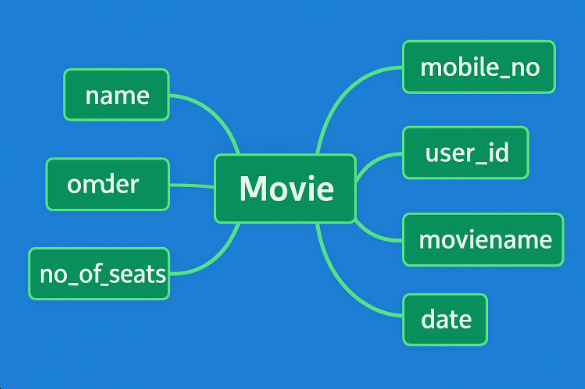

# Ex02 Django ORM Web Application
## Date: 20.10.2025

## AIM
To develop a Django application to store and retrieve data from Movies Database using Object Relational Mapping(ORM).

## ENTITY RELATIONSHIP DIAGRAM



## DESIGN STEPS

### STEP 1:
Clone the problem from GitHub

### STEP 2:
Create a new app in Django project

### STEP 3:
Enter the code for admin.py and models.py

### STEP 4:
Execute Django admin and create details for 10 books

## PROGRAM
```
admin.py

from django.contrib import admin
from .models import Movie,MovieAdmin
admin.site.register(Movie,MovieAdmin)

models.py

from django.db import models
from django.contrib import admin
class Movie (models.Model):
    user_id=models.IntegerField(primary_key=True)
    name=models.CharField(max_length=100)
    mobile_no=models.IntegerField()
    email=models.EmailField()
    moviename=models.CharField(max_length=100)
    no_of_seats=models.IntegerField()
    date=models.DateField()
    
 
class MovieAdmin(admin.ModelAdmin):
    list_display=('user_id','name','moviename','no_of_seats','date')
```

## OUTPUT


## RESULT
Thus the program for creating a database using ORM hass been executed successfully
